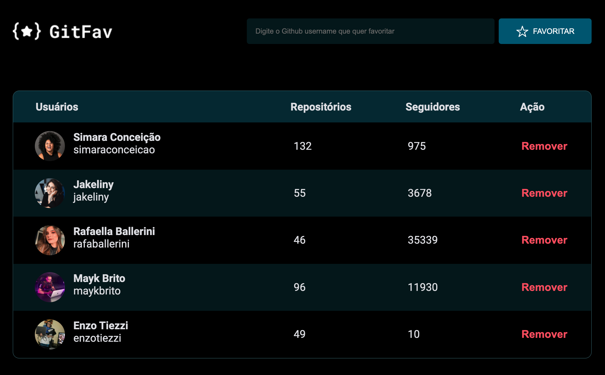

# Git Fav

Lista de usuários favoritos do Github.
 

## ⚒️ Tecnologias

- HTML
- CSS
- JavaScript
- Github

 

## 📖 Pontos abordados - JavaScript
* Classes
* Heranças (extends - super)
* Eventos
* Desestruturação 
* Local Storage
* Utilização de API
* Try Catch

 

## ⚙️ Funcionalidades
* Busca de usuário pelo login
* Apresentação de dados reais do usuário
* Inclusão e exclusão de usuários da lista
* Mensagem de erro, caso o usuário não seja encontrado
* Mensagem de confirmação para remoção do usuário
* Tela de aviso de lista vazia
